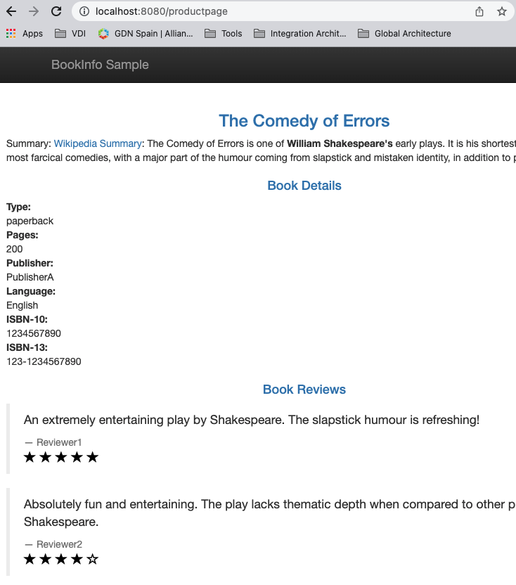
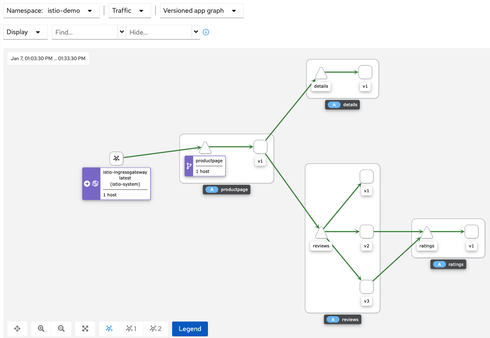

# Istio playground

## Prerequisites

### 1.- kubectl & helm

In case you don't have these tools:

[Install kubectl and Helm](doc/00_MACOS-COMMON-TOOLS.md)

### 2.- A Kubernetes cluster

In cse you don't have acces to a cluster to test, you have these options to install it locally:
* KinD (Docker): [MacOS: Install Docker Kind](doc/00_MACOS-DOCKER-KIND.md)
* KinD (Podman): [MacOS: Install Podman Kind](doc/00_MACOS-PODMAN-KIND.md)
* Minikube: [MacOS: Install Docker and Minikube](doc/00_MACOS-DOCKER-MINIKUBE.md)

### 3.- Istio

To install Istio on an existing cluster: [Install Istio](doc/01_INSTALL_ISTIO.md)

## Istio Sample Application

[Install Istio Sample Application](doc/02_INSTALL_BOOKINFO_APPLICATION.md)

Check access

View the istio dashboard

