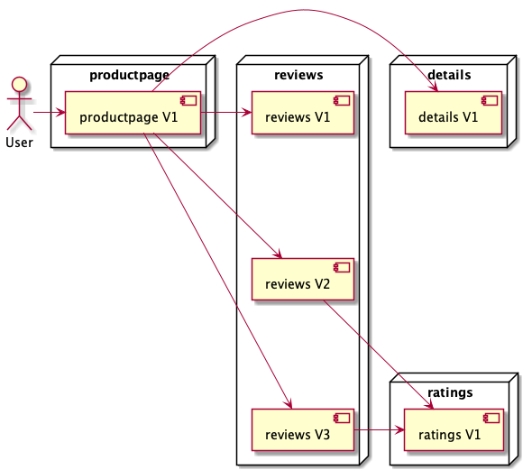
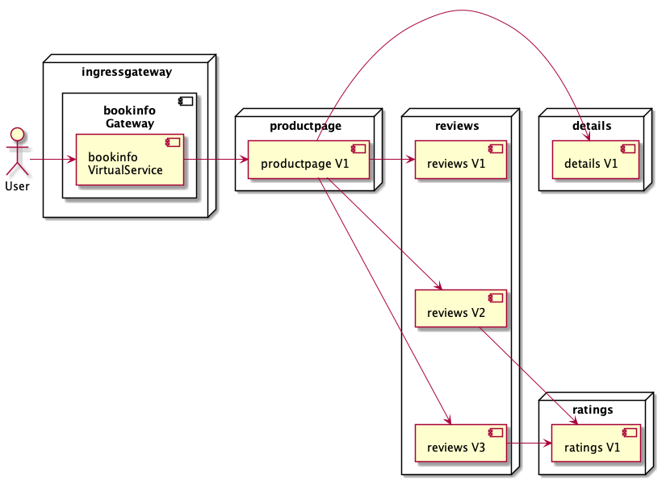

# Install the sample application

## Prepare the namespace

https://istio.io/latest/docs/setup/getting-started/#bookinfo
To run in a different namespace (for example bookinfo)
```shell
kubectl create namespace bookinfo
kubectl label namespace bookinfo istio-injection=enabled
kubectl config set-context --current --namespace=bookinfo
```

Otherwise, just label the default:
```shell
# add
kubectl label namespace default istio-injection=enabled

# remove
kubectl label namespace default istio-injection-

# check
kubectl get namespaces default -o yaml
```

## Deploy the sample application

See: https://istio.io/latest/docs/examples/bookinfo/

```shell
# See: https://raw.githubusercontent.com/istio/istio/1.13.2/samples/bookinfo/platform/kube/bookinfo.yaml
kubectl apply -f samples/bookinfo/platform/kube/bookinfo.yaml

# check services and pods are being deployed
kubectl get services
kubectl get pods
# notice in case of pods the sidecar has also been deployed (Two containers in the READY column - 2/2)

kubectl exec "$(kubectl get pod -l app=ratings -o jsonpath='{.items[0].metadata.name}')" -c ratings -- curl -sS productpage:9080/productpage | grep -o "<title>.*</title>"
```



## Open the application to outside traffic

Create the `Gateway` and a `VirtualService` pointing to `productpage`




```shell
# See: https://raw.githubusercontent.com/istio/istio/1.13.2/samples/bookinfo/networking/bookinfo-gateway.yaml
cat <<EOF | kubectl apply -f -
apiVersion: networking.istio.io/v1alpha3
kind: Gateway
metadata:
  namespace: istio-ingress
  name: bookinfo-gateway
spec:
  selector:
    istio: ingressgateway # use istio default controller
  servers:
  - port:
      number: 80
      name: http
      protocol: HTTP
    hosts:
    - "*"
---
apiVersion: networking.istio.io/v1alpha3
kind: VirtualService
metadata:
  namespace: bookinfo
  name: bookinfo
spec:
  hosts:
  - "*"
  gateways:
  - bookinfo-gateway
  http:
  - match:
    - uri:
        exact: /productpage
    - uri:
        prefix: /static
    - uri:
        exact: /login
    - uri:
        exact: /logout
    - uri:
        prefix: /api/v1/products
    route:
    - destination:
        host: productpage
        port:
          number: 9080
EOF 

# Ensure that there are no issues with the configuration:
istioctl analyze
```

## Test

Determining the ingress IP and ports

See: https://istio.io/latest/docs/setup/getting-started/#determining-the-ingress-ip-and-ports

For minikube th commands are different:
```shell
export INGRESS_PORT=$(kubectl -n istio-ingress get service istio-ingress -o jsonpath='{.spec.ports[?(@.name=="http2")].nodePort}')
export SECURE_INGRESS_PORT=$(kubectl -n istio-ingress get service istio-ingress -o jsonpath='{.spec.ports[?(@.name=="https")].nodePort}')
echo "INGRESS_PORT=$INGRESS_PORT" # should be 30080
echo "SECURE_INGRESS_PORT=$SECURE_INGRESS_PORT" # should be 300443

# check the port mappings
docker port istio-playground-control-plane
# 30080/tcp -> 0.0.0.0:8080
# 30443/tcp -> 0.0.0.0:8443

export INGRESS_MAPPED_PORT="80"
export SECURE_INGRESS_MAPPED_PORT="443"
export INGRESS_HOST="127.0.0.1"
export GATEWAY_URL=$INGRESS_HOST:$INGRESS_MAPPED_PORT
export GATEWAY_SECURE_URL=$INGRESS_HOST:$SECURE_INGRESS_MAPPED_PORT

echo "INGRESS_MAPPED_PORT=$INGRESS_MAPPED_PORT"
echo "SECURE_INGRESS_MAPPED_PORT=$SECURE_INGRESS_MAPPED_PORT"

echo "http://$GATEWAY_URL/productpage"

# hit the URL 100 times
cat > test.sh << EOF
#!/bin/bash
for i in \$(seq 1 100); do 
curl -s -o /dev/null "http://\${GATEWAY_URL}/productpage"
done
EOF
chmod a+x test.sh
./test.sh
rm test.sh
```


## Apply default destination rules

See: https://raw.githubusercontent.com/istio/istio/1.13.2/samples/bookinfo/networking/destination-rule-all.yaml

```shell
kubectl apply -f samples/bookinfo/networking/destination-rule-all.yaml
```

Create the `DestinationRule` objects

```yaml
apiVersion: networking.istio.io/v1alpha3
kind: DestinationRule
metadata:
  name: productpage
spec:
  host: productpage
  subsets:
  - name: v1
    labels:
      version: v1
---
apiVersion: networking.istio.io/v1alpha3
kind: DestinationRule
metadata:
  name: reviews
spec:
  host: reviews
  subsets:
  - name: v1
    labels:
      version: v1
  - name: v2
    labels:
      version: v2
  - name: v3
    labels:
      version: v3
---
apiVersion: networking.istio.io/v1alpha3
kind: DestinationRule
metadata:
  name: ratings
spec:
  host: ratings
  subsets:
  - name: v1
    labels:
      version: v1
  - name: v2
    labels:
      version: v2
  - name: v2-mysql
    labels:
      version: v2-mysql
  - name: v2-mysql-vm
    labels:
      version: v2-mysql-vm
---
apiVersion: networking.istio.io/v1alpha3
kind: DestinationRule
metadata:
  name: details
spec:
  host: details
  subsets:
  - name: v1
    labels:
      version: v1
  - name: v2
    labels:
      version: v2
---
```